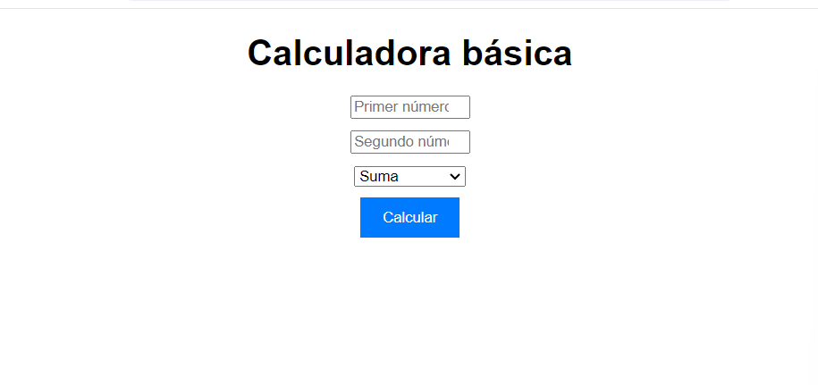
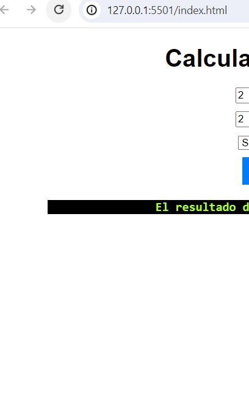
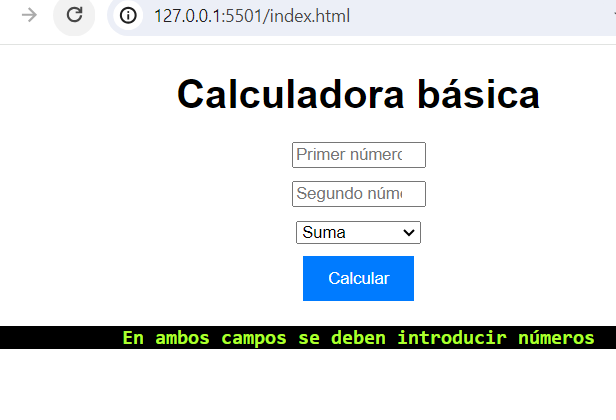

# Calculadora básica de TándEM Aranjuez
- Versión: 0.1
- Autor: **Abdel**
- Licencia: MIT





[como hacer un readme](como-hacer-un-readme.md)

## Descripción de nuestra calculadora básica
Esta aplicación tiene como intención realizar operaciones entre dos numeros que se introduzcan; de suma, resta, multiplicación y división; en un equipo cliente. Para luego obtener el resultado de dichas operaciones mediante un mensaje que te saldrá en el navegador tras hacer click en el botón calcular.

## Objetivos

- Realizar operaciones de suma, resta, multiplicación y división; entre dos numeros que se introduzcan.


## Tecnologías utilizadas


## Arquitectura de nuestra calculadora básica en un archivo index.html utilizando Visual Studio Code

```
<!DOCTYPE html>
<html lang="es">

<head>
    <meta charset="UTF-8">
    <meta name="viewport" content="width=device-width, initial-scale=1.0">
    <title>Aplicación web simple</title>
    <link rel="stylesheet" href="style.css">
</head>

<body>
    <div class="container">
        <h1>Calculadora básica</h1>
        <div class="borde">

     
        <div>
            <input type="number" id="num1" placeholder="Primer número">
        </div>
        <div>
            <input type="number" id="num2" placeholder="Segundo número">
        </div>
        <div>
            <select id="operacion">
                <option value="+">Suma</option>
                <option value="-">Resta</option>
                <option value="*">Multiplicación</option>
                <option value="/">División</option>
            </select>
        </div>
        <div>
            <button onclick="calcular()">Calcular</button>
        </div>
        <p id="resultado">
            
        </p>
    </div>
    </div>
    <script src="script.js"></script>
</body>

</html>
```
## Arquitectura de nuestra calculadora básica en un archivo style.css utilizando Visual Studio Code

```
body {
    font-family: sans-serif;
}

.container {
    max-width: 600px;
    margin: auto;
    text-align: center;
}

h1 {
    text-align: center;
    margin-bottom: 20px;
}

input[type="number"],
select {
    width: 100px;
    margin-bottom: 10px;
}

button {
    padding: 10px 20px;
    background-color: #007bff;
    color: white;
    border: none;
    cursor: pointer;
}

#resultado {
    text-align: center;
    font-family: consola, monospace;
    color: greenyellow;
    background-color: black;
    font-weight: bold;
    margin-top: 20px;
}
```

## Arquitectura de nuestra calculadora básica en un archivo script.js utilizando Visual Studio Code

```
const divResultado = document.getElementById('resultado')
function calcular() {
    const num1 = parseFloat(document.getElementById('num1').value);
    const num2 = parseFloat(document.getElementById('num2').value);
    if (isNaN(num1) || isNaN(num2)) {
        divResultado.textContent= 'En ambos campos se deben introducir números';
        return;
    }
    const operacion = document.getElementById('operacion').value;

    let resultado;

    switch (operacion) {
        case '+':
            resultado = num1 + num2;
            break;
        case '-':
            resultado = num1 - num2;
            break;
        case '*':
            resultado = num1 * num2;
            break;
        case '/':
            if (num2 === 0) {
                divResultado.textContent= 'No se puede dividir por cero';
                return;
            }
            resultado = num1 / num2;
            break;
        default:
            divResultado.textContent= 'Operación no válida';
            return;
    }

   divResultado.textContent = `
    El resultado de la operación ${operacion} es: ${resultado}
    `;
}
```


## Funcionalidades


- La aplicación cuenta con un botón de calcular

- La aplicación cuenta con 2 menús desplegables para elegir dos números

- La aplicación cuenta con 1 menú desplegable para elegir las cuatro operaciones que se puede realizar en la aplicación


## Instrucciones de instalación

Descarga el zip de la siguiente url: 
[https://github.com/acuati/calculadorabasica.git](https://github.com/acuati/calculadorabasica.git) 

O en el shell haz un git clone.
```shell
git clone https://github.com/acuati/calculadorabasica.git
```
Una vez descargado incluyalo en un repositorio y ejecutalo a través de un navegador.
```
http://localhost:3000/
```

## Instucciones de uso

1. Introduce el primer número

2. Introduce el segundo número

3. Elige la operación que quiere realizar en la aplicación

4. Pulsa el botón de calcular y se guardará para consultar después el resultado de dicha operación(aparecerá debajo)

5. Podrás borrar los datos generados en el navegador con el botón de refrescar la página





## Solución de problemas comunes

- El botón está deshabilitado y no te dejará realizar la operacion hasta que no introduzcas dos números 

## Información de contacto:
Puedes contactar con el personal administrador de esta aplicación, o proponer tu contribución a través de nuestro correo:
[benalibenaliabdelkbir@gmail.com](mailto:benalibenaliabdelkbir@gmail.com)

[Teléfono: 66666666](tel:+34666666666)

### Reconocimientos:
>Agradecimientos a MDN por sus tutoriales.


### Apéndices:
Más información en nuestro github:
[Acuati](https://Acuati.github.io)

## Versiones
|Versión|Fecha|Cambios|
|--|--|--|
|0.1|19/04/24|funcionalidad básica|